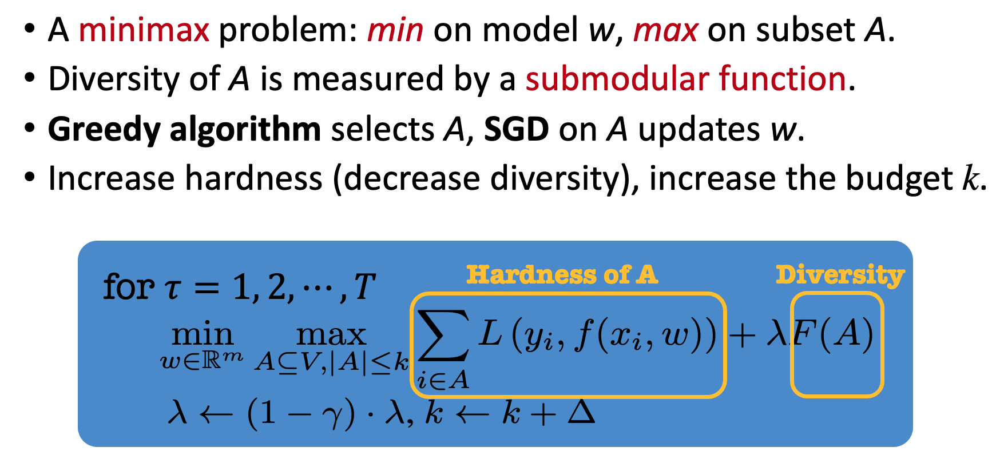

# Minimax Curriculum Learning (MCL)

## ICLR 2018 paper:

<b>Title</b>: <i>Minimax Curriculum Learning: Machine Teaching with Desirable Difficulties and Scheduled Diversity</i> <a href="https://openreview.net/pdf?id=BywyFQlAW">[pdf]</a>\
<b>Authors</b>: Tianyi Zhou, Jeff A. Bilmes\
<b>Institute</b>: University of Washington, Seattle

<pre>
@inproceedings{
    zhou2018mcl,
    title={Minimax Curriculum Learning: Machine Teaching with Desirable Difficulties and Scheduled Diversity},
    author={Tianyi Zhou and Jeff A. Bilmes},
    booktitle={Proceedings of The 6th International Conference on Learning Representations (ICLR)},
    year={2018},
}</pre>

<b>Abstract</b>\
We introduce and study minimax curriculum learning (MCL), a new method for adaptively selecting a sequence of training subsets for a succession of stages in machine learning. The subsets are encouraged to be small and diverse early on, and then larger, harder, and allowably more homogeneous in later stages. At each stage, model weights and training sets are chosen by solving a joint continuous-discrete minimax optimization, whose objective is composed of a continuous loss (reflecting training set hardness) and a discrete submodular promoter of diversity for the chosen subset. MCL repeatedly solves a sequence of such optimizations with a schedule of increasing training set size and decreasing pressure on diversity encouragement. We reduce MCL to the minimization of a surrogate function handled by submodular maximization and continuous gradient methods. We show that MCL achieves better performance and, with a clustering trick, uses fewer labeled samples for both shallow and deep models while achieving the same performance. Our method involves repeatedly solving constrained submodular maximization of an only slowly varying function on the same ground set. Therefore, we develop a heuristic method that utilizes the previous submodular maximization solution as a warm start for the current submodular maximization process to reduce computation while still yielding a guarantee.

## Usage 

### Prerequisites
- [Python 3.7.4](https://www.python.org/)
- [PyTorch 1.1.0](https://pytorch.org/)
- [Numpy 1.17.2](http://www.numpy.org/)
- [Scikit-Learn 0.22.1](https://scikit-learn.org/)
- [Progress 1.5](https://github.com/verigak/progress/)
- [Pillow 6.2.2](https://pillow.readthedocs.io/en/stable/)

### Instructions
- For now, we keep all the MCL code in `mcl.py`. It supports multiple datasets and models. You can add your own options.
- Example scripts to run MCL on CIFAR10/100 for training WideResNet-28-10 can be found in `mcl_cifar.sh`.
- We apply multiple episodes of training epochs, each following a cosine annealing learning rate decreasing from `--lr_max` to `--lr_min`. The episodes can be set by epoch numbers, for example, `--epochs 300 --schedule 0 5 10 15 20 30 40 60 90 140 210 300`.
- MCL increases the selected subset's size over the training episodes. Set how to reduce the size by `--k 0.1 --dk 0.2 --mk 0.9` for example, which starts from a subset size (k * n) and multiplies it by (1 + dk) until reaching (mk * n).
- To encourage diversity in the data selection, add `--use_centrality` to further prune the selected subset to a few diverse and representative samples according to samples' centrality (defined on pairwise similarity between samples). Set the corresponding selection ratio and how you want to change the ratio every episode, for example, `--select_ratio 0.5 --select_ratio_rate 1.1` will further reduce the MCL-selected subset to be its half size in the first non-warm-starting episode and then multiply this ratio by 1.1 for every future episode until selection_ratio = 1.
- Centrality is an alternative of the facility location function in the paper in order to encourage diversity. The latter requires an external submodular maximization library and extra computation, compared to the centrality used here. We may add the option of submodular maximization for facility location in the future. Centrality is a modular function and performs slightly poorer than the facility location.
- Self-supervised learning may help in some scenarios. Two types of self-supervision regularizations are supported, i.e., `--consistency` and `--contrastive`.
- If one is interested to try MCL on noisy-label learning (though not the focus of the paper), add `--use_noisylabel` and specify the noisy type and ratio using `--label_noise_type` and `--label_noise_rate`. They are zeros by default.

<b>License</b>\
This project is licensed under the terms of the MIT license.
